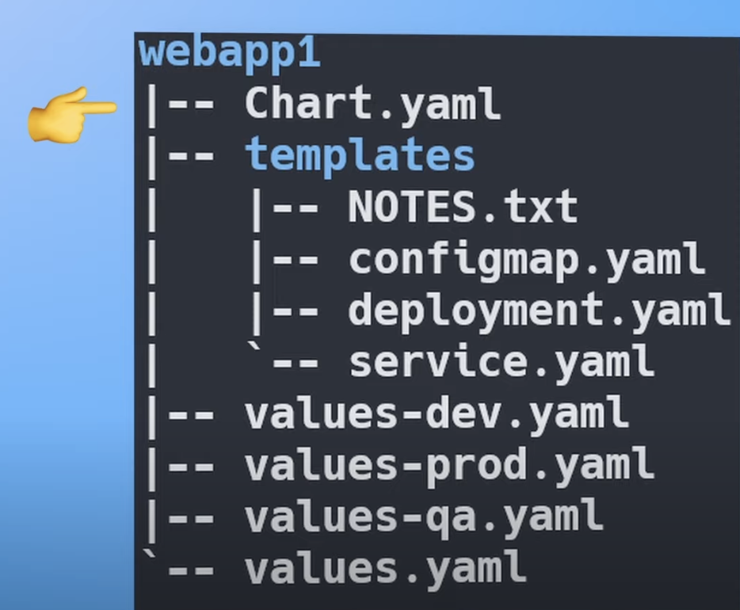
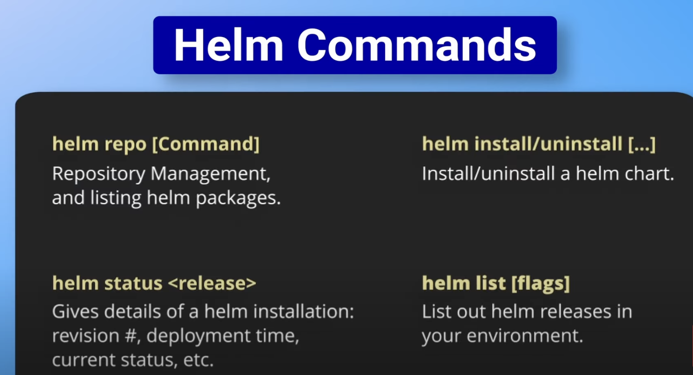

# Helm Tập lệnh quản lý gói k8s (Package manement k8s)
Hỗ trợ deploy, k8s, 
Thông số hoá , đặt biến để giúp dể dàng quản lý k8s hơn

1. Cấu trúc resoure
{width=20px height=15px}


2. Command thường sử dụng

Example on ArtifactHUb
```sh
helm repo add prometheus-community https://prometheus-community.github.io/helm-charts
helm install my-prometheus prometheus-community/prometheus --version 25.0.0
helm install my-prometheus-dev prometheus-community/prometheus --version 15.12.0 --namespace dev
```

```sh
helm ls --all-namespaces    			# get tất cả app  deploy with helm
helm ls --all-namespaces -a  			# get tất cả app (status)
helm uninstall my-prometheus --keep-history   # xoá app nhưng giữu lại history để có thể rollback
helm upgrade my-prometheus-dev prometheus-community/prometheus --version 25.0.0 --namespace dev  # xoá app nhưng giữu lại history để có thể rollback
helm history my-prometheus-dev -n dev 			#xem lịch sử của app
helm rollback my-prometheus-dev 1 -n dev
helm show values  prometheus-community/prometheus
```

## 3.References
[Devops Jouney -English](https://youtu.be/w51lDVuRWuk?si=JIEf-BIqWOwJW0Q-)
[Devops Viêt]()

## 4. Practies
thực thành với helm-webapp

```sh
helm upgrade {name_app} {path_chart_helm} --values {path_file_values_update} #format
helm upgrade nghiepnc-release3 solution/webapp1 --values solution/webapp1/values.yaml  
```

Về các triển khai thì có thể coi qua Clip

* Tóm tắt
Nguyên tắt deployment với nhiều môi trường thì mình phải chuyển port theo từng namespace để nó trỏ ra.
- Helm hỗ trợ depploy nhanh với k8s
- Cấu trúc file thành các biến động, có thể custom nhanh với các biến tương ứng đó
